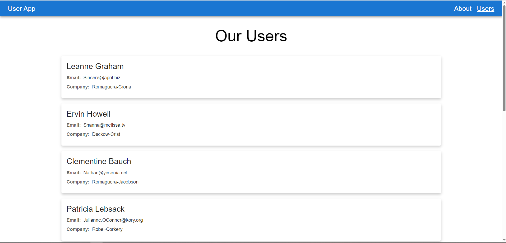

# React User App - Live Demo

A simple yet functional web application for browsing a list of users and viewing their detailed information. This project was built to demonstrate key skills in the modern React technology stack.

### ✨ [**Live Demo Link**](https://optimistixx.github.io/react-user-app-demo/) ✨

---

### 📸 Screenshot



---

### 🚀 Features

*   **User List:** The main page displays a list of all users fetched from an API.
*   **User Details:** Click on any user to navigate to a dedicated page with their detailed information.
*   **Responsive Design:** Thanks to Material-UI, the application looks great on various devices.
*   **State Handling:** Displays a loading indicator while fetching data and an error message if the request fails.

---

### 💻 Tech Stack

*   **React:** The core library for building the UI.
*   **TypeScript:** For static typing and enhanced code reliability.
*   **React Router:** For client-side routing and navigation in a Single Page Application.
*   **Material-UI (MUI):** For a rich set of UI components and styling.
*   **Custom Hooks:** Data fetching logic is encapsulated in a reusable `useFetch` hook to keep components clean and DRY (Don't Repeat Yourself).
*   **GitHub Pages:** For deployment and hosting.

---

### 🛠️ Getting Started Locally

To get a local copy up and running, follow these simple steps.

1.  **Clone the repository:**
    ```bash
    git clone https://github.com/OPTIMISTIXX/react-user-app-demo.git
    cd react-user-app-demo
    ```

2.  **Install NPM packages:**
    ```bash
    npm install
    ```

3.  **Run the development server:**
    ```bash
    npm start
    ```

    The application will be available at `http://localhost:3000`.